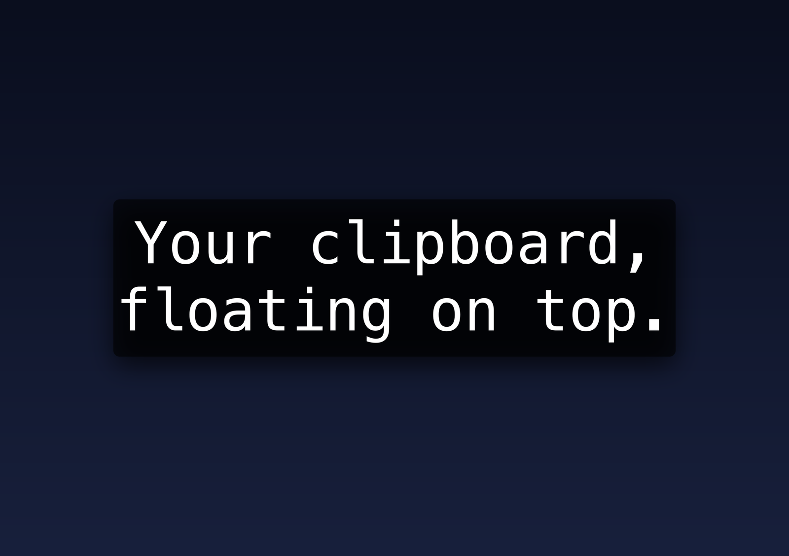

# ClipDisplay

A lightweight native macOS menu-bar app that displays your clipboard text in a fully-styleable, always-on-top floating overlay. Built as a replacement for the "Hotkey" app, adding the font/color/size/position controls it lacks.



- **Native Swift + AppKit** (SwiftUI for the settings form) — no Electron, ~0% idle CPU
- **Agent app** — no Dock icon, just a menu-bar clipboard icon
- Overlay floats above all windows, all Spaces, and full-screen apps
- Drag the overlay anywhere; position and all styling persist across launches

## Hotkeys (global, no Accessibility permission needed)

| Default | Action |
|---|---|
| `⌥⇧Space` | Read clipboard → show styled overlay; press again to dismiss |
| `⌘⇧H` | Toggle overlay visibility (without re-reading the clipboard) |

Both are rebindable in Settings: click the shortcut, then press any combination that includes `⌘`, `⌥`, or `⌃` (press `⎋` to cancel).

## Settings

Open **Settings…** from the menu-bar icon. All changes apply to the overlay live: font family, size, bold, text color, background color + opacity, alignment, padding, overlay width/height, hotkey bindings, and a reset-position button.

Colors can optionally follow the system appearance: enable **Follow system light/dark mode** to configure separate text/background sets for light and dark mode — the overlay switches automatically when macOS does. Leave it off to lock a single set.

Sizing adapts to the clipboard (each behavior is a toggle): the overlay hugs small content and grows up to the configured max width/height; content that overflows at the chosen font size shrinks down to 10 pt to fit; a long unbroken run with nowhere to wrap (a URL, a token) shrinks to stay on one line rather than breaking mid-word; anything still overflowing (a big JSON blob, say) scrolls with an auto-hiding scrollbar.

## Build & run

Requires macOS 14+ (Apple Silicon) and the Xcode Command Line Tools — full Xcode is not needed.

```sh
./build-app.sh        # builds release binary + assembles ClipDisplay.app (ad-hoc signed)
open ClipDisplay.app  # or drop it in /Applications
```

During development:

```sh
swift run
```

See [SPEC.md](SPEC.md) for the full build spec.
